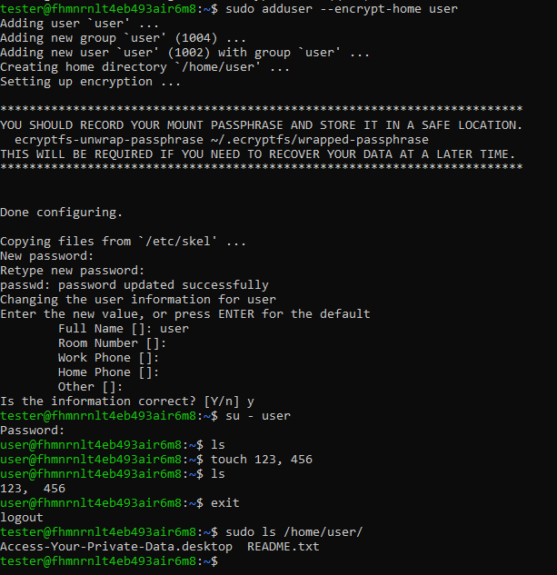
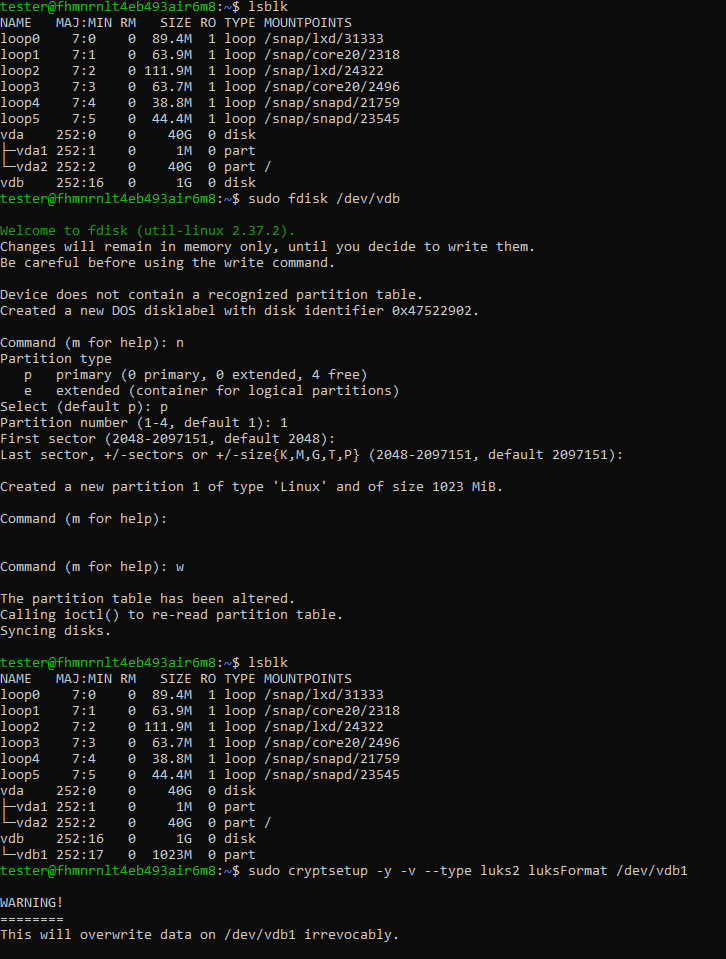
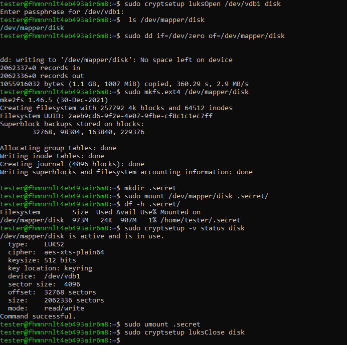
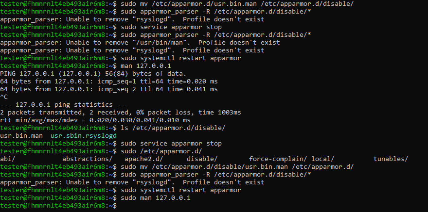

# Домашнее задание к занятию  «`Защита хоста`» - `Виталий Коряко`

https://github.com/netology-code/sdb-homeworks/blob/main/13-02.md 

### Задание 1

1. Установите **eCryptfs**.
2. Добавьте пользователя cryptouser.
3. Зашифруйте домашний каталог пользователя с помощью eCryptfs.


*В качестве ответа  пришлите снимки экрана домашнего каталога пользователя с исходными и зашифрованными данными.*  

### Решение 1

```
sudo apt-get update
sudo apt-get install ecryptfs-utils
sudo adduser --encrypt-home user
su - user
touch 123, 456
ls .
exit
sudo ls /home/user
```


### Задание 2

1. Установите поддержку **LUKS**.
2. Создайте небольшой раздел, например, 100 Мб.
3. Зашифруйте созданный раздел с помощью LUKS.

*В качестве ответа пришлите снимки экрана с поэтапным выполнением задания.*

### Решение 2

```
sudo apt-get update
sudo apt-get install cryptsetup
cryptsetup --version

lsblk
sudo fdisk /dev/vdb
sudo cryptsetup -y -v --type luks2 luksFormat /dev/vdb1

sudo cryptsetup luksOpen /dev/vdb1 disk
ls /dev/mapper/disk

sudo dd if=/dev/zero of=/dev/mapper/disk
sudo mkfs.ext4 /dev/mapper/disk

mkdir .secret
sudo mount /dev/mapper/disk .secret/
df -h .secret/
sudo cryptsetup -v status disk

sudo umount .secret
sudo cryptsetup luksClose disk
```





## Дополнительные задания (со звёздочкой*)

Эти задания дополнительные, то есть не обязательные к выполнению, и никак не повлияют на получение вами зачёта по этому домашнему заданию. Вы можете их выполнить, если хотите глубже шире разобраться в материале

### Задание 3 *

1. Установите **apparmor**.
2. Повторите эксперимент, указанный в лекции.
3. Отключите (удалите) apparmor.


*В качестве ответа пришлите снимки экрана с поэтапным выполнением задания.*


### Решение 3 *

```
sudo apt install apparmor-profiles apparmor-utils apparmor-profiles-extra
sudo apparmor_status

sudo cp /usr/bin/man /usr/bin/man1
sudo cp /bin/ping /usr/bin/man

sudo man 127.0.0.1

sudo service apparmor stop
sudo mv /etc/apparmor.d/usr.bin.man /etc/apparmor.d/disable/
sudo apparmor_parser -R /etc/apparmor.d/disable/*
sudo systemctl restart apparmor

sudo man 127.0.0.1
```


